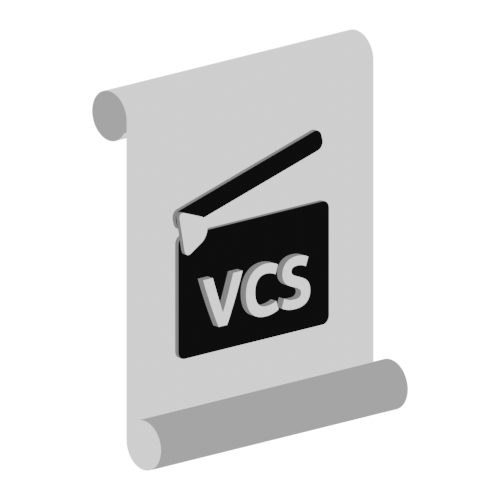

## Contact
[Blender.chat](https://blender.chat/channel/blenderorganizer_vcstudio)

[devtalk.Blender.org](https://devtalk.blender.org/t/blender-organizer-vcstudio-organization-of-the-projects)

# VCStudio

New And Improved Movie Creation Tool, Based on [Blender Organizer](https://github.com/JYamihud/blender-organizer).

The old Blender Organizer project was using an outdated Python2 for the entire system.
It became such a hard thing to make work on a new system. Since Python2 is not longer supported by most destributions. And so the decision was made in 2020 to move to Python3. The problem was that the gtk module of python2 is similar but not the same as Gtk3 that comes with python3. And so a complite rewrite of the blender organizer is nessesary.

The Blender Organizer also had some questionable desing elements that made it hard to implement new feratures and settings without clusterring the project folder. And also it had a wierd way of handinling multiple projects.

## Blender Organizer still lives.
I think for most people who are Using the Blender Organizer. To switch to an untested new project would be a terrible thing. This is why I'm not using the Blender Organizer repository for the rewrite, but instead choosing to create this new one. Which gonna go away from being named after Blender but more after the little studio title we have for our animation project. VCS (Violence, Children, Studio).

Few VCS projects just as [I'm Not Even Human](https://open.lbry.com/@VCS:7/Imnotevenhumanshortfilm:3?r=HnvEmZbrkAHCcWf7PDVzShfp4xafcBMW) and [The Package, The Car & The Time Is Running Out](https://open.lbry.com/@VCS:7/ThePackageTheCarAndTheTimeIsRunningOut:3?r=HnvEmZbrkAHCcWf7PDVzShfp4xafcBMW) were made using the Old Blender Organizer. 

The current Moria's Race project is now using the old one. But since it's a relativelly small folder. (4.3 GB of DATA on November 11 2020). We gonna use a copy of the project to build this new tool. This way we gonna in-sure a high level of backward compatibility with the old Blender-Organizer projects.

## Plans

[Projects Page](https://github.com/JYamihud/VCStudio/projects)

- [x] Build a terminal based application for checking the VCStudio installation. (troubleshooter)
- [ ] Build a automatic fixer to the troubleshooter.
- [x] Build a terminal based manager for creating new projects / entering them / and configuring basic settings.
- [x] Make a Graphical version of the manager. (Not on every system you have access to graphical interface)
- [ ] Make a tranlating layer. Or a recofiguration layer. To move old project to the new system.
- [ ] Make a terminal based VCStudio with all the features of the organizer.
- [ ] Make a Graphical version of the VCStudio.

When those steps are finished. We can move to maintaining and updating the software to meet our needs.

## Ideas

* Full Organizer from Terminal. Maybe with a simplified story editor. But so the management, editing of the screen-play and rendering could be done without a Graphical interface. Or on systems that do not support GTK.
* Server / Client way of working on the project. For larger studios that have multiple computers on a local network. It will require an algorythm that will merge changes done by different people. And we need a file version mechanism. Like in Git-Hub.
* New, customizable UI. With full Themes, Language packs and other customizable things.
* Sound & Music workflow. I don't know what it's going to be. But for now there is just a stupid folder for that.
* Multiple AST files from one asset. Like same character with different clothes. And such.
* Live script editor. (With an option to edit code directly as in Blender-Organizer.)
* Scheduling with time, not only date. And a alert system when the time for the next task comes. Also scheduling based on the user. So let's say a director can schedule something for an animator.
* Messaging system.
